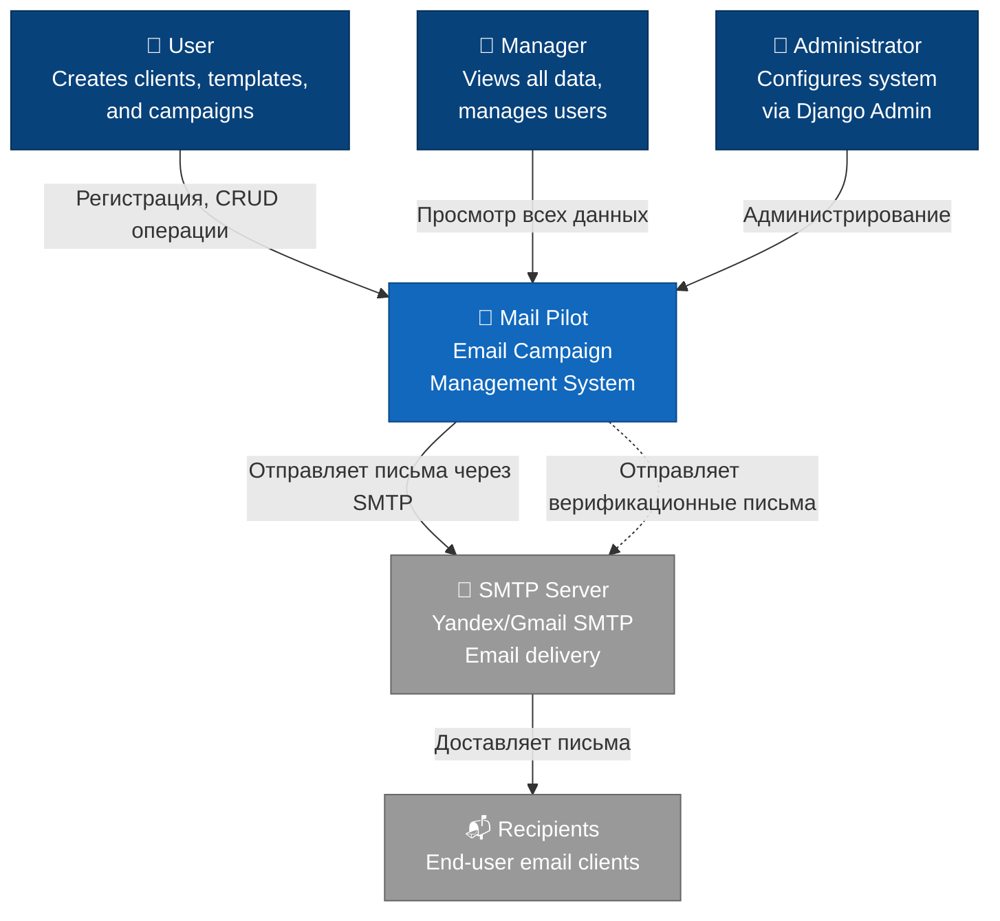
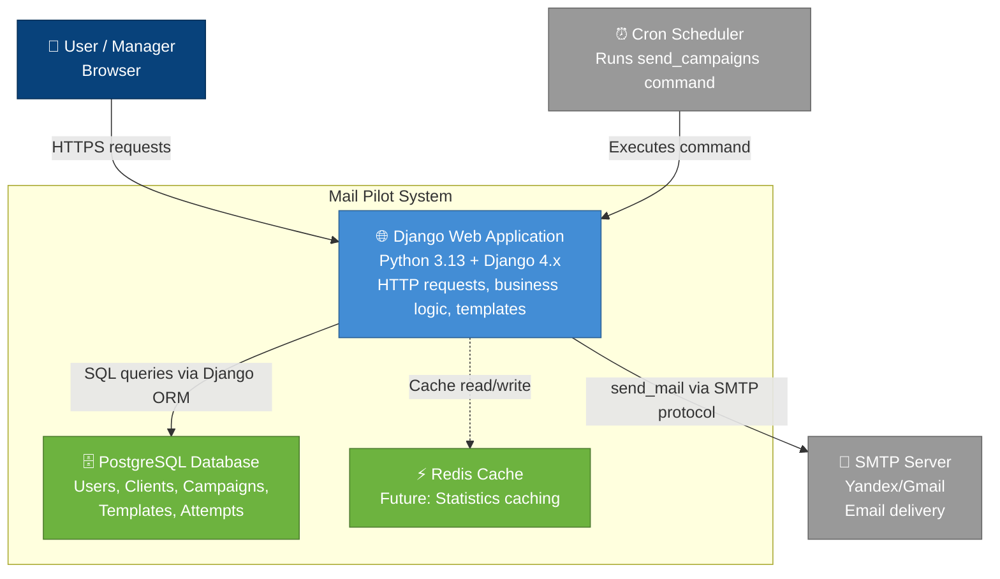
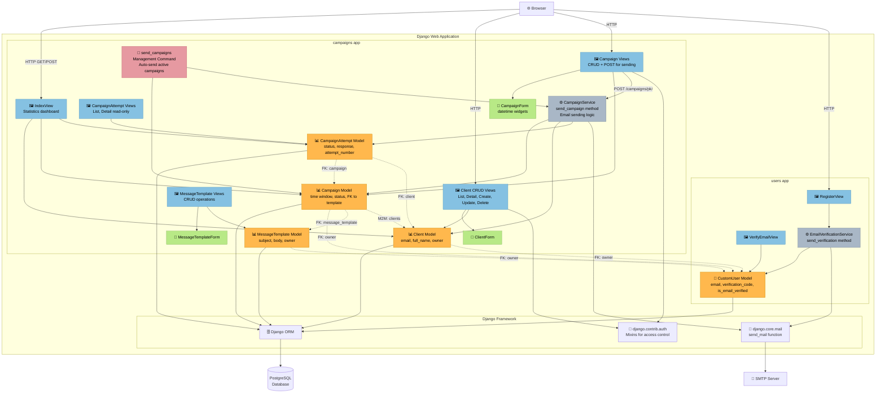
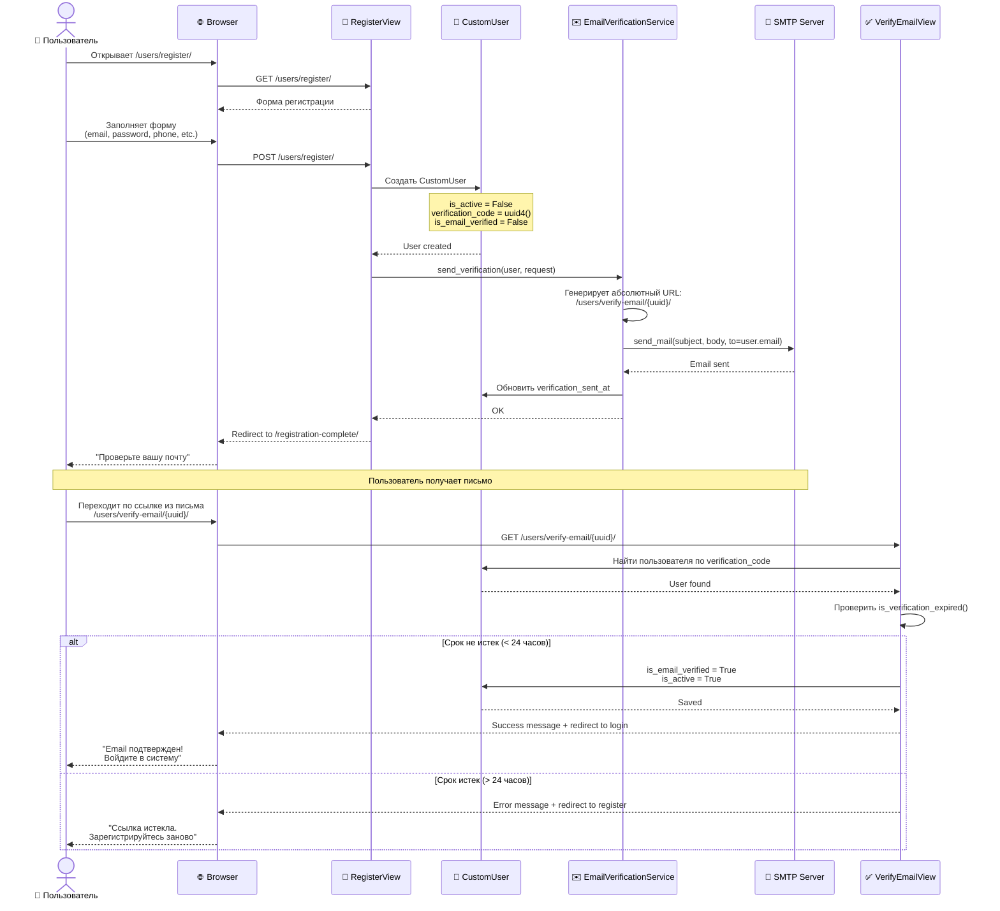
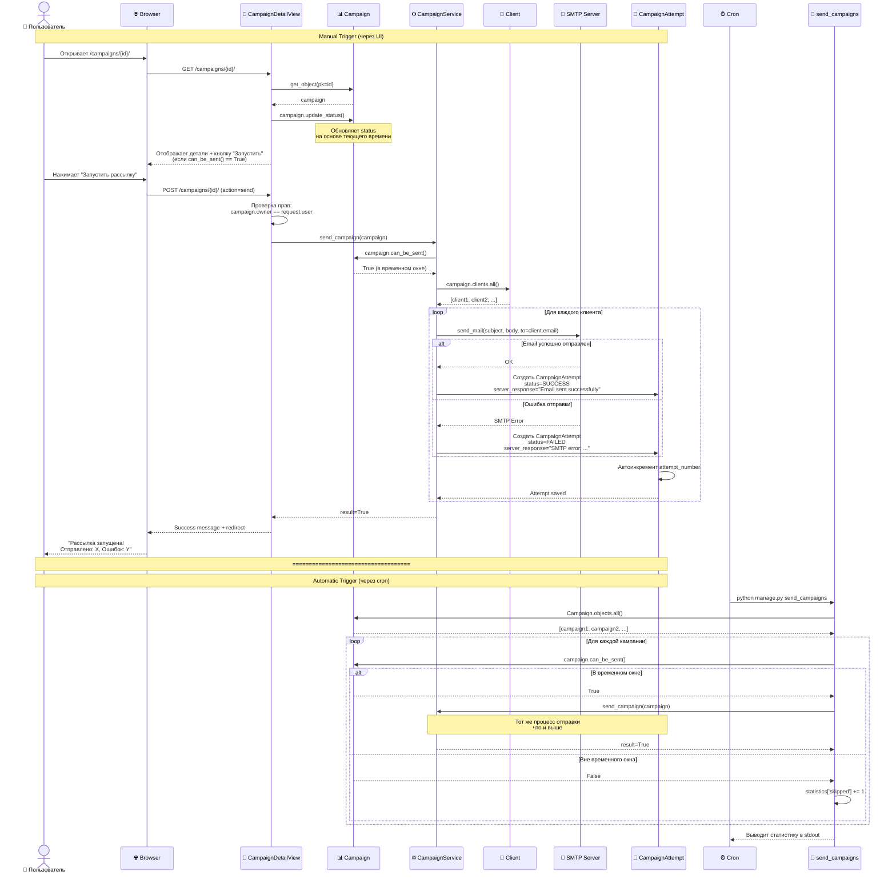

# C4 Architecture Diagrams - Mail Pilot

Данный документ содержит архитектурные диаграммы проекта Mail Pilot в нотации C4 Model.

**Навигация:**
- [Level 1: System Context](#level-1-system-context)
- [Level 2: Container Diagram](#level-2-container-diagram)
- [Level 3: Component Diagram](#level-3-component-diagram-campaigns-app)
- [Sequence Diagrams](#sequence-diagrams)
  - [Registration & Email Verification Flow](#registration--email-verification-flow)
  - [Campaign Sending Flow](#campaign-sending-flow)

---

## Level 1: System Context

**Цель:** Показать Mail Pilot как единую систему в контексте пользователей и внешних систем.

**Описание:**
- Три типа пользователей: обычные пользователи, менеджеры и администраторы
- Mail Pilot взаимодействует с SMTP сервером для отправки писем
- Получатели получают письма через свои email-клиенты

**Ключевые взаимодействия:**
1. Пользователи создают кампании через веб-интерфейс
2. Менеджеры имеют доступ ко всем данным (read-only для чужих данных)
3. Администраторы настраивают систему через Django Admin
4. Mail Pilot отправляет письма через внешний SMTP сервер
5. Система отправляет верификационные письма при регистрации

---

## Level 2: Container Diagram

**Цель:** Показать основные технологические контейнеры и их взаимодействие.

**Описание:**
- Django Web Application - основное приложение
- PostgreSQL - база данных
- SMTP Server - внешний сервис для отправки email
- (Future) Redis Cache - для кеширования статистики

**Технологический стек:**
- **Web App**: Django 4.x, Python 3.13, Poetry (dependency management)
- **Database**: PostgreSQL (или SQLite для разработки)
- **SMTP**: Yandex SMTP / Gmail SMTP (настраивается через .env)
- **Cache**: Redis (планируется для кеширования статистики)
- **Deployment**: Gunicorn + Nginx (production), runserver (development)

**Коммуникация:**
- User ↔ Web App: HTTPS (HTML, CSS, JS)
- Web App ↔ Database: PostgreSQL protocol через Django ORM
- Web App ↔ SMTP: SMTP protocol (порт 587 с TLS)
- Cron → Web App: CLI команда `python manage.py send_campaigns`

---

## Level 3: Component Diagram (campaigns app)

**Цель:** Показать внутреннюю структуру Django приложения с фокусом на campaigns app.

**Описание:**
- Компоненты разбиты на слои: Models, Views, Services, Management Commands
- Показаны связи между users и campaigns приложениями

**Ключевые компоненты:**

### Models (Модели данных)
- **Client**: Получатель рассылки (email, full_name, comment, owner)
- **MessageTemplate**: Шаблон письма (subject, body, owner)
- **Campaign**: Кампания (start/end time, status, message_template FK, clients M2M)
- **CampaignAttempt**: Попытка отправки (campaign FK, client FK, status, server_response)
- **CustomUser**: Пользователь (email, verification_code UUID, is_email_verified)

### Views (Представления)
- **CRUD Views**: Стандартные ListView, DetailView, CreateView, UpdateView, DeleteView
- **IndexView**: Главная страница с агрегированной статистикой
- **CampaignDetailView**: Детали кампании + POST endpoint для запуска отправки
- **Access Control**: LoginRequiredMixin + UserPassesTestMixin на всех views

### Services (Бизнес-логика)
- **CampaignService**: Логика отправки кампании (send_campaign method)
  - Проверка временного окна (can_be_sent)
  - Итерация по клиентам
  - Отправка через send_mail()
  - Создание CampaignAttempt для каждого клиента
- **EmailVerificationService**: Отправка верификационных писем

### Management Commands
- **send_campaigns**: Автоматическая отправка всех активных кампаний (для cron)

---

## Sequence Diagrams

### Registration & Email Verification Flow

**Описание:** Процесс регистрации нового пользователя с верификацией email.

**Ключевые моменты:**
1. При регистрации создается пользователь с `is_active=False`
2. Генерируется UUID verification_code (не 6-значный код!)
3. Отправляется письмо со ссылкой вида `/users/verify-email/{uuid}/`
4. Ссылка действительна 24 часа (проверка через verification_sent_at)
5. После верификации устанавливается `is_active=True` и `is_email_verified=True`

---

### Campaign Sending Flow

**Описание:** Процесс отправки email-кампании (manual trigger или automatic via cron).

**Ключевые моменты:**

**Manual Trigger:**
1. Пользователь открывает детали кампании
2. `update_status()` динамически обновляет статус на основе текущего времени
3. Кнопка "Запустить" видна только если `can_be_sent()` возвращает True
4. POST запрос проверяет права доступа (owner)
5. Вызывается `CampaignService.send_campaign()`

**Automatic Trigger (Cron):**
1. Cron запускает `python manage.py send_campaigns`
2. Команда загружает все кампании из БД
3. Для каждой проверяет `can_be_sent()` (временное окно)
4. Вызывает тот же `CampaignService.send_campaign()`

**Отправка:**
1. Сервис итерируется по всем клиентам кампании
2. Для каждого клиента вызывает `send_mail()`
3. Создает `CampaignAttempt` с результатом (SUCCESS/FAILED)
4. `attempt_number` автоматически инкрементируется в `save()` методе модели

**Логирование:**
- Каждая попытка сохраняется в БД (таблица CampaignAttempt)
- Хранится статус, серверный ответ, время попытки
- Позволяет отследить историю отправок и диагностировать проблемы

---

## Дополнительная информация

### Паттерны проектирования

**Repository Pattern (через Django ORM):**
- Все обращения к БД через Django ORM
- Менеджеры моделей (`.objects`) как репозитории

**Service Layer Pattern:**
- `CampaignService` - бизнес-логика отправки
- `EmailVerificationService` - логика верификации
- Отделение бизнес-логики от views

**MVC (MTV в Django):**
- Models: data layer
- Templates: presentation layer
- Views: controller layer

### Безопасность

**Аутентификация:**
- Django session-based auth
- Email как USERNAME_FIELD
- Password hashing (PBKDF2)

**Авторизация:**
- `LoginRequiredMixin` на всех CRUD views
- `UserPassesTestMixin` для проверки owner
- Permissions для менеджеров (`can_view_all_campaigns`)

**Access Control:**
- Фильтрация данных по owner в `get_queryset()`
- Managers видят все данные (read-only для чужих)
- Users видят только свои данные

### Масштабирование (Future)

**Текущие ограничения:**
- Синхронная отправка писем (блокирующая операция)
- Нет retry механизма для failed attempts

**Планируемые улучшения:**
- Celery для асинхронной отправки
- Retry logic с exponential backoff
- Rate limiting для SMTP
- Redis для кеширования статистики

---

## Ссылки

- [C4 Model](https://c4model.com/) - официальная документация C4
- [Mermaid Documentation](https://mermaid.js.org/) - синтаксис диаграмм
- [README.md](../README.md) - техническая документация проекта
- [CLAUDE.md](../CLAUDE.md) - руководство для разработки
