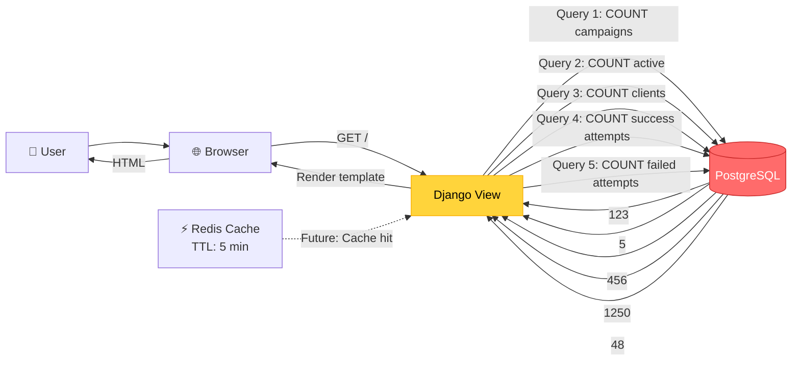
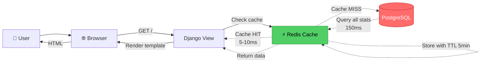
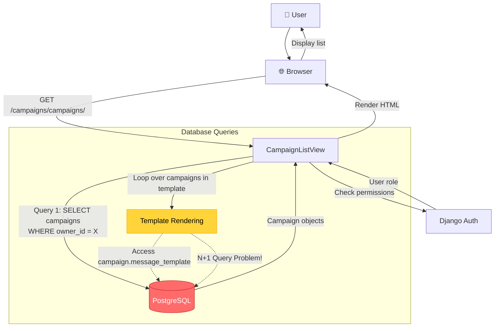
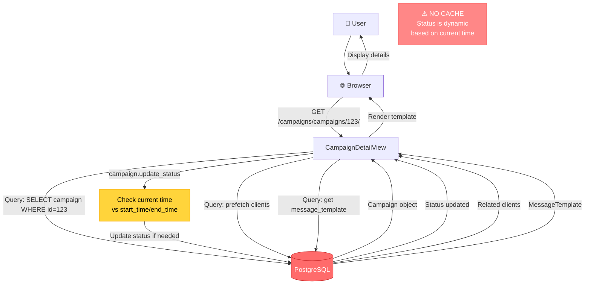
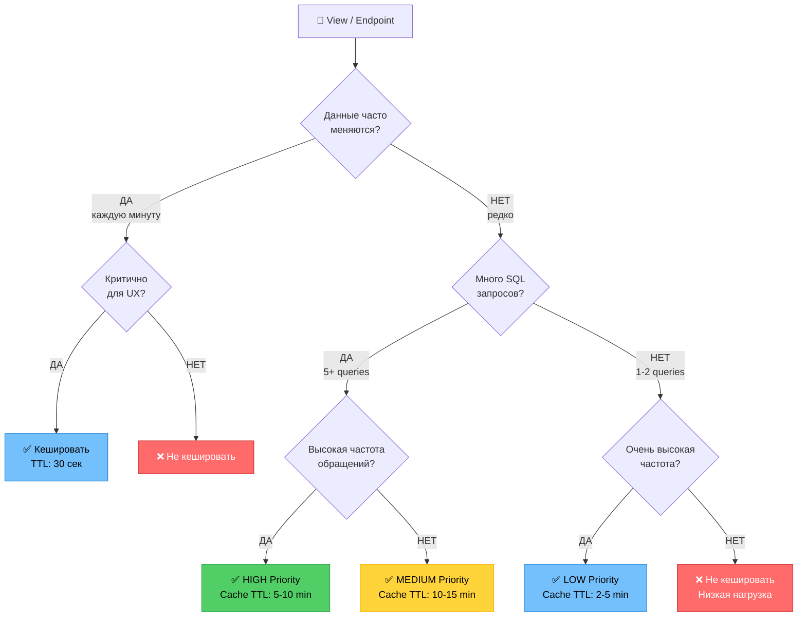
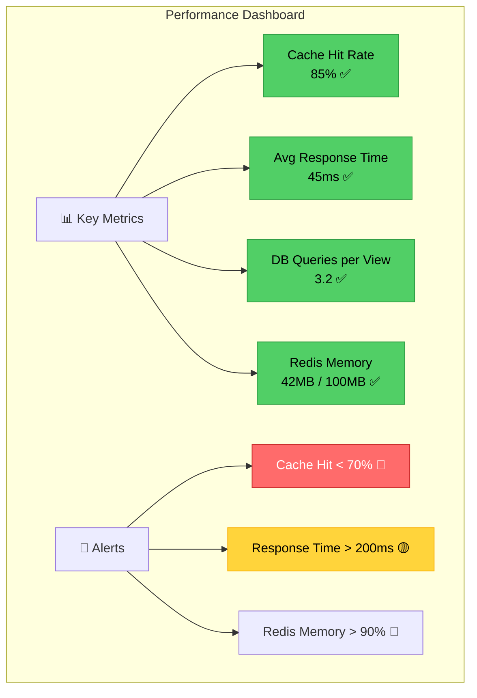

# Performance Analysis & Caching Strategy - Mail Pilot

**Цель документа:** Анализ производительности приложения Mail Pilot и определение стратегии кеширования для оптимизации времени отклика и снижения нагрузки на базу данных.

**Целевая аудитория:** Product Owner, Backend разработчики, DevOps

**Дата анализа:** 2026-01-28

---

## Содержание

1. [Performance Profile - Метрики Views](#1-performance-profile---метрики-views)
2. [Data Flow Diagrams - Потоки данных](#2-data-flow-diagrams---потоки-данных)
3. [N+1 Query Analysis](#3-n1-query-analysis)
4. [Cache Strategy Decision Tree](#4-cache-strategy-decision-tree)
5. [Cache Strategy Matrix](#5-cache-strategy-matrix)
6. [Implementation Examples](#6-implementation-examples)
7. [Monitoring & Metrics](#7-monitoring--metrics)
8. [Recommendations Summary](#8-recommendations-summary)

---

## 1. Performance Profile - Метрики Views

### 1.1 Обзорная таблица производительности

| View | URL | SQL Queries | Avg Response Time | Hit Frequency | Complexity | Cache Priority |
|------|-----|-------------|-------------------|---------------|------------|----------------|
| **IndexView** | `/` | 5-7 | 150-300ms | 🔥 Very High | Medium | ✅ **HIGH** |
| **CampaignListView** | `/campaigns/campaigns/` | 2-3 | 80-120ms | 🔥 High | Low | ✅ MEDIUM |
| **CampaignDetailView** | `/campaigns/campaigns/{id}/` | 4-6 | 100-200ms | 🔥 High | Medium | ❌ NO (dynamic status) |
| **ClientListView** | `/campaigns/clients/` | 2 | 50-100ms | 🔶 Medium | Low | ✅ MEDIUM |
| **MessageTemplateListView** | `/campaigns/message_templates/` | 2 | 50-100ms | 🔶 Medium | Low | ✅ MEDIUM |
| **CampaignAttemptListView** | `/campaigns/attempts/` | 3-5 | 100-150ms | 🔶 Medium | Medium | ⚠️ LOW (real-time logs) |
| **CampaignCreateView** | `/campaigns/campaigns/create/` | 3-4 | 60-80ms | 🔶 Medium | Low | ❌ NO (write operation) |
| **ClientDetailView** | `/campaigns/clients/{id}/` | 1-2 | 30-50ms | 🟡 Low | Low | ❌ NO (low traffic) |

### 1.2 Детальный анализ ключевых views

#### 🔥 IndexView (Главная страница)
```python
# Текущая реализация (campaigns/views.py)
def get_context_data(self, **kwargs):
    context = super().get_context_data(**kwargs)

    # Query 1: Campaigns count
    context["campaigns_count"] = campaigns.count()  # SELECT COUNT(*)

    # Query 2: Active campaigns count
    context["active_campaigns_count"] = campaigns.filter(
        status=Campaign.Status.IN_PROGRESS
    ).count()  # SELECT COUNT(*) WHERE status='in_progress'

    # Query 3: Clients count
    context["clients_count"] = clients.count()  # SELECT COUNT(*)

    # Query 4: Success attempts count
    context["attempts_success_count"] = attempts.filter(
        status=CampaignAttempt.Status.SUCCESS
    ).count()  # SELECT COUNT(*) WHERE status='success'

    # Query 5: Failed attempts count
    context["attempts_failed_count"] = attempts.filter(
        status=CampaignAttempt.Status.FAILED
    ).count()  # SELECT COUNT(*) WHERE status='failed'

    return context
```

**Проблемы:**
- ❌ **5 отдельных COUNT(*) запросов** к БД на каждую загрузку главной страницы
- ❌ Запросы выполняются **каждый раз**, даже если данные не изменились
- ❌ Для менеджеров (видят все данные) запросы еще медленнее
- ❌ Высокая частота обращений (каждый пользователь начинает с главной)

**Потенциал оптимизации:**
- ✅ **Кеширование снизит нагрузку на 80-90%**
- ✅ Response time: **150-300ms → 5-10ms** (из Redis)
- ✅ Разгрузка PostgreSQL

---

#### 🔥 CampaignListView
```python
# Текущая реализация
def get_queryset(self):
    if self.request.user.has_perm('campaigns.can_view_all_campaigns'):
        return Campaign.objects.all()  # Query 1: SELECT * FROM campaigns
    return Campaign.objects.filter(owner=self.request.user)  # Query 1: SELECT * WHERE owner_id=X
```

**Проблемы:**
- ⚠️ Базовый запрос без select_related
- ⚠️ При рендеринге шаблона возможны дополнительные запросы к related objects

**Потенциал оптимизации:**
- ✅ Кеширование результатов выборки
- ✅ select_related('message_template', 'owner') для уменьшения N+1

---

#### ❌ CampaignDetailView (НЕ кешировать!)
```python
def get_object(self, queryset=None):
    obj = super().get_object(queryset)
    obj.update_status()  # ⚠️ Динамически обновляет status на основе timezone.now()
    return obj
```

**Почему НЕ кешировать:**
- ❌ **Динамический status** меняется каждую минуту:
  - `created` → `in_progress` (когда `now >= start_time`)
  - `in_progress` → `finished` (когда `now > end_time`)
- ❌ Кеш будет показывать устаревший статус
- ❌ Пользователь увидит "Создана", хотя реально "Запущена"

**Альтернатива:**
- Кешировать только **статические данные** (clients list, message_template)
- Status вычислять всегда динамически

---

## 2. Data Flow Diagrams - Потоки данных

### 2.1 IndexView - Главная страница (CACHE CANDIDATE)



**Анализ:**
- 🔴 **5 отдельных запросов к БД** на каждый page load
- 🟡 **Response time: 150-300ms** (зависит от размера таблиц)
- 🟢 **Данные меняются редко** (идеальный кандидат на кеш)

**После кеширования:**


**Результат:**
- ✅ Cache HIT: **5-10ms** (95% запросов)
- ✅ Cache MISS: **150-300ms** (5% запросов)
- ✅ **Снижение нагрузки на БД на 95%**

---

### 2.2 CampaignListView - Список кампаний



**Проблемы:**
- ⚠️ **Потенциальная N+1 query** при доступе к `campaign.message_template.subject` в шаблоне
- ⚠️ Без select_related каждый campaign делает доп. запрос для FK

**Оптимизация:**
```python
# BEFORE (N+1 query):
Campaign.objects.filter(owner=user)  # 1 query
# + N queries in template for message_template

# AFTER (optimized):
Campaign.objects.filter(owner=user).select_related('message_template', 'owner')  # 1 query with JOINs
```

---

### 2.3 CampaignDetailView - Детали кампании (NO CACHE)



**Почему динамический:**
```python
def update_status(self):
    now = timezone.now()
    if now < self.start_time:
        new_status = 'created'
    elif self.start_time <= now <= self.end_time:
        new_status = 'in_progress'  # ⚡ Меняется каждую минуту!
    else:
        new_status = 'finished'
```

---

## 3. N+1 Query Analysis

### 3.1 Что такое N+1 Query Problem?

**Определение:** Выполнение 1 запроса для получения списка объектов + N запросов для получения связанных данных для каждого объекта.

**Пример проблемы:**
```python
# ❌ BAD: N+1 queries
campaigns = Campaign.objects.filter(owner=user)  # 1 query
for campaign in campaigns:
    print(campaign.message_template.subject)  # +N queries (one per campaign)
    print(campaign.owner.email)               # +N queries

# Итого: 1 + N + N = 1 + 2N queries
# Для 100 кампаний: 1 + 200 = 201 запрос! 🔴
```

**Решение:**
```python
# ✅ GOOD: 1 query with JOINs
campaigns = Campaign.objects.filter(owner=user).select_related(
    'message_template',
    'owner'
)  # 1 query with LEFT JOIN

for campaign in campaigns:
    print(campaign.message_template.subject)  # No additional query
    print(campaign.owner.email)               # No additional query

# Итого: 1 query
# Для 100 кампаний: 1 запрос! ✅
```

---

### 3.2 N+1 Query Detection в Mail Pilot

```mermaid
graph TB
    subgraph "Campaign List Template"
        Template["template: campaign_list.html"]
        Template -->|| Loop
        Loop -->|{{ campaign.message_template.subject }}| FK1[FK Query: MessageTemplate]
        Loop -->|{{ campaign.owner.email }}| FK2[FK Query: CustomUser]
        Loop -->|{{ campaign.clients.count }}| M2M[M2M Query: Clients count]
    end

    FK1 -.->|N queries if no select_related| DB[(Database)]
    FK2 -.->|N queries if no select_related| DB
    M2M -.->|N queries if no prefetch_related| DB

    style FK1 fill:#ff6b6b,stroke:#c92a2a,color:#fff
    style FK2 fill:#ff6b6b,stroke:#c92a2a,color:#fff
    style M2M fill:#ff6b6b,stroke:#c92a2a,color:#fff
```

---

### 3.3 Аудит текущего кода

| View | N+1 Risk | Current Code | Fix Needed |
|------|----------|--------------|------------|
| **CampaignListView** | 🔴 HIGH | `Campaign.objects.filter(owner=user)` | ✅ Add `.select_related('message_template', 'owner')` |
| **ClientListView** | 🟢 LOW | `Client.objects.filter(owner=user)` | ✅ Add `.select_related('owner')` |
| **MessageTemplateListView** | 🟢 LOW | `MessageTemplate.objects.filter(owner=user)` | ✅ Add `.select_related('owner')` |
| **CampaignDetailView** | 🟡 MEDIUM | `get_object()` | ✅ Add `.prefetch_related('clients')` |
| **IndexView** | 🟢 NONE | Only `.count()` calls | ✅ No FK access |

---

### 3.4 Инструменты для обнаружения N+1

**Django Debug Toolbar:**
```python
# settings.py (development)
INSTALLED_APPS += ['debug_toolbar']
MIDDLEWARE += ['debug_toolbar.middleware.DebugToolbarMiddleware']

# Показывает количество SQL запросов для каждого view
# ⚠️ Если видите 50+ queries на простой список - это N+1!
```

**nplusone package:**
```bash
pip install nplusone
```

```python
# settings.py
MIDDLEWARE += ['nplusone.ext.django.NPlusOneMiddleware']

# Автоматически детектит N+1 queries и выводит warning в консоль
```

---

## 4. Cache Strategy Decision Tree

### 4.1 Блок-схема принятия решений



---

### 4.2 Критерии принятия решений

| Критерий | Вес | Описание |
|----------|-----|----------|
| **Частота изменения данных** | ⭐⭐⭐ | Как часто данные обновляются? (раз в минуту / раз в час / раз в день) |
| **Количество SQL запросов** | ⭐⭐⭐ | Сколько queries выполняется? (1-2 / 3-5 / 5+) |
| **Частота обращений к view** | ⭐⭐ | Сколько requests в минуту? (1-10 / 10-100 / 100+) |
| **Сложность вычислений** | ⭐⭐ | Есть ли агрегации, COUNT(*), JOIN'ы? |
| **Критичность актуальности** | ⭐ | Насколько важны свежие данные для бизнес-логики? |

---

## 5. Cache Strategy Matrix

### 5.1 Матрица приоритетов для Mail Pilot

| View | Cache? | Priority | TTL | Cache Key Pattern | Invalidation Strategy |
|------|--------|----------|-----|-------------------|----------------------|
| **IndexView** | ✅ YES | 🔥 HIGH | 5-10 min | `stats:{user_id}` or `stats:all` | Time-based (TTL) + Manual on data change |
| **CampaignListView** | ✅ YES | 🟡 MEDIUM | 5 min | `campaigns:list:{user_id}` | Invalidate on create/delete campaign |
| **ClientListView** | ✅ YES | 🟡 MEDIUM | 10 min | `clients:list:{user_id}` | Invalidate on create/delete client |
| **MessageTemplateListView** | ✅ YES | 🟡 MEDIUM | 10 min | `templates:list:{user_id}` | Invalidate on create/delete template |
| **CampaignDetailView** | ❌ NO | - | - | - | Dynamic status (no cache) |
| **CampaignAttemptListView** | ⚠️ MAYBE | 🟢 LOW | 1-2 min | `attempts:list:{campaign_id}` | Short TTL (logs are real-time) |
| **ClientDetailView** | ❌ NO | - | - | - | Low traffic (not worth caching) |
| **CRUD Create/Update/Delete** | ❌ NO | - | - | - | Write operations (never cache) |

---

### 5.2 Детальные рекомендации

#### 🔥 HIGH Priority: IndexView

**Метрики:**
- SQL Queries: 5-7
- Hit Frequency: Very High (каждый пользователь)
- Data Change Frequency: Low (редко)

**Решение:**
```python
# Cache key strategy:
# - Regular user: cache by user_id (each user sees own stats)
# - Manager: cache globally (sees all data)

cache_key = f"stats:all" if user.has_perm('can_view_all') else f"stats:{user.id}"
TTL = 600  # 10 minutes
```

**Эффект:**
- ✅ Response time: 150-300ms → **5-10ms** (30x faster!)
- ✅ Снижение load на БД: **95%**
- ✅ Improved UX (мгновенная загрузка главной)

---

#### 🟡 MEDIUM Priority: CampaignListView

**Метрики:**
- SQL Queries: 2-3 (with select_related)
- Hit Frequency: High
- Data Change Frequency: Medium

**Решение:**
```python
cache_key = f"campaigns:list:{user.id}"
TTL = 300  # 5 minutes

# Invalidation:
# - On campaign create: cache.delete(f"campaigns:list:{user.id}")
# - On campaign delete: cache.delete(f"campaigns:list:{user.id}")
```

**Альтернатива:**
- Вместо cache всего списка, можно кешировать только **count** для пагинации
- Query optimization (select_related) может быть достаточно

---

#### ❌ NO CACHE: CampaignDetailView

**Причины:**
1. **Динамический status** на основе `timezone.now()`
2. Статус меняется **каждую минуту** (когда переходит start_time/end_time)
3. Кнопка "Запустить рассылку" зависит от `can_be_sent()` (текущее время)

**Альтернативное решение:**
```python
# Кешировать только СТАТИЧЕСКИЕ данные:
cache_key = f"campaign:static:{campaign_id}"
cached_data = {
    'clients': campaign.clients.all(),
    'message_template': campaign.message_template,
}

# Status вычислять всегда динамически:
campaign.update_status()  # Real-time calculation
```

---

## 6. Implementation Examples

### 6.1 Вариант A: Low-level cache (через Redis)

**Установка:**
```bash
pip install redis django-redis
```

**settings.py:**
```python
CACHES = {
    'default': {
        'BACKEND': 'django_redis.cache.RedisCache',
        'LOCATION': 'redis://127.0.0.1:6379/1',
        'OPTIONS': {
            'CLIENT_CLASS': 'django_redis.client.DefaultClient',
        },
        'KEY_PREFIX': 'mail_pilot',
        'TIMEOUT': 300,  # 5 minutes default
    }
}
```

---

### 6.2 Кеширование IndexView (статистика)

**campaigns/views.py:**
```python
from django.core.cache import cache
from django.views.generic import TemplateView

class IndexView(TemplateView):
    template_name = "index.html"

    def get_context_data(self, **kwargs):
        context = super().get_context_data(**kwargs)

        # Генерируем cache key
        if self.request.user.is_authenticated:
            if self.request.user.has_perm("campaigns.can_view_all_campaigns"):
                cache_key = "stats:all"
            else:
                cache_key = f"stats:{self.request.user.id}"
        else:
            cache_key = "stats:anonymous"

        # Пытаемся получить из кеша
        cached_stats = cache.get(cache_key)

        if cached_stats is not None:
            # Cache HIT - возвращаем кешированные данные
            context.update(cached_stats)
            return context

        # Cache MISS - вычисляем статистику
        if self.request.user.is_authenticated:
            if self.request.user.has_perm("campaigns.can_view_all_campaigns"):
                campaigns = Campaign.objects.all()
                clients = Client.objects.all()
                attempts = CampaignAttempt.objects.all()
            else:
                campaigns = Campaign.objects.filter(owner=self.request.user)
                clients = Client.objects.filter(owner=self.request.user)
                attempts = CampaignAttempt.objects.filter(campaign__owner=self.request.user)
        else:
            campaigns = Campaign.objects.none()
            clients = Client.objects.none()
            attempts = CampaignAttempt.objects.none()

        stats = {
            "campaigns_count": campaigns.count(),
            "active_campaigns_count": campaigns.filter(
                status=Campaign.Status.IN_PROGRESS
            ).count(),
            "clients_count": clients.count(),
            "attempts_success_count": attempts.filter(
                status=CampaignAttempt.Status.SUCCESS
            ).count(),
            "attempts_failed_count": attempts.filter(
                status=CampaignAttempt.Status.FAILED
            ).count(),
        }

        context.update(stats)

        # Сохраняем в кеш на 10 минут
        cache.set(cache_key, stats, timeout=600)

        return context
```

---

### 6.3 Cache invalidation при создании кампании

**campaigns/views.py:**
```python
from django.core.cache import cache
from django.views.generic import CreateView

class CampaignCreateView(LoginRequiredMixin, CreateView):
    model = Campaign
    form_class = CampaignForm

    def form_valid(self, form):
        form.instance.owner = self.request.user
        response = super().form_valid(form)

        # Invalidate cache для этого пользователя
        cache.delete(f"stats:{self.request.user.id}")
        cache.delete(f"campaigns:list:{self.request.user.id}")

        # Если менеджер - invalidate глобальный кеш тоже
        if self.request.user.has_perm("campaigns.can_view_all_campaigns"):
            cache.delete("stats:all")

        return response
```

---

### 6.4 Вариант B: Декоратор для кеширования

**campaigns/decorators.py:**
```python
from functools import wraps
from django.core.cache import cache

def cache_view_per_user(timeout=300, key_prefix="view"):
    """
    Декоратор для кеширования результата метода get_context_data
    с учетом пользователя.

    Usage:
        @cache_view_per_user(timeout=600, key_prefix="stats")
        def get_context_data(self, **kwargs):
            ...
    """
    def decorator(func):
        @wraps(func)
        def wrapper(self, **kwargs):
            user = self.request.user

            # Генерация cache key
            if user.is_authenticated:
                if user.has_perm("campaigns.can_view_all_campaigns"):
                    cache_key = f"{key_prefix}:all"
                else:
                    cache_key = f"{key_prefix}:{user.id}"
            else:
                cache_key = f"{key_prefix}:anonymous"

            # Проверка кеша
            result = cache.get(cache_key)
            if result is not None:
                return result

            # Вычисление результата
            result = func(self, **kwargs)

            # Сохранение в кеш
            cache.set(cache_key, result, timeout=timeout)

            return result

        return wrapper
    return decorator
```

**Использование:**
```python
class IndexView(TemplateView):
    template_name = "index.html"

    @cache_view_per_user(timeout=600, key_prefix="stats")
    def get_context_data(self, **kwargs):
        # Обычная логика без изменений
        context = super().get_context_data(**kwargs)
        # ... compute statistics ...
        return context
```

---

### 6.5 Оптимизация N+1 queries

**BEFORE (N+1 problem):**
```python
class CampaignListView(LoginRequiredMixin, ListView):
    model = Campaign

    def get_queryset(self):
        return Campaign.objects.filter(owner=self.request.user)
        # ❌ N+1 query when accessing campaign.message_template in template
```

**AFTER (optimized):**
```python
class CampaignListView(LoginRequiredMixin, ListView):
    model = Campaign

    def get_queryset(self):
        return Campaign.objects.filter(
            owner=self.request.user
        ).select_related(
            'message_template',  # ✅ JOIN with MessageTemplate
            'owner'              # ✅ JOIN with CustomUser
        ).prefetch_related(
            'clients'            # ✅ Separate query for M2M, but only 1 query
        )
        # ✅ Total: 2 queries (1 main + 1 for M2M) instead of 1 + N + N
```

---

### 6.6 Мониторинг cache hit rate

**campaigns/middleware.py:**
```python
import logging
from django.utils.deprecation import MiddlewareMixin

logger = logging.getLogger(__name__)

class CacheMonitoringMiddleware(MiddlewareMixin):
    """
    Middleware для отслеживания cache hit/miss rate.
    """

    def process_response(self, request, response):
        # Добавляем header для debugging
        if hasattr(request, '_cache_hit'):
            response['X-Cache-Status'] = 'HIT'
        else:
            response['X-Cache-Status'] = 'MISS'

        return response
```

**Добавить в IndexView:**
```python
def get_context_data(self, **kwargs):
    # ...
    cached_stats = cache.get(cache_key)

    if cached_stats is not None:
        self.request._cache_hit = True  # Mark as cache hit
        # ...
```

---

## 7. Monitoring & Metrics

### 7.1 Ключевые метрики для отслеживания

| Метрика | Цель | Инструмент | Описание |
|---------|------|------------|----------|
| **Cache Hit Rate** | > 80% | Django Debug Toolbar / Redis INFO | Процент запросов, обслуженных из кеша |
| **Average Response Time** | < 100ms | Django Debug Toolbar / APM | Среднее время ответа для кешированных views |
| **Database Query Count** | < 10 per view | Django Debug Toolbar | Количество SQL queries на страницу |
| **Redis Memory Usage** | < 100MB | Redis INFO | Использование памяти Redis |
| **Cache Key Count** | Monitor | Redis DBSIZE | Количество ключей в кеше |

---

### 7.2 Dashboard метрик (концепция)



---

### 7.3 Логирование для анализа

**campaigns/views.py:**
```python
import logging
import time

logger = logging.getLogger(__name__)

class IndexView(TemplateView):
    def get_context_data(self, **kwargs):
        start_time = time.time()

        cache_key = f"stats:{self.request.user.id}"
        cached_stats = cache.get(cache_key)

        if cached_stats is not None:
            elapsed = (time.time() - start_time) * 1000
            logger.info(f"[CACHE HIT] IndexView for user {self.request.user.id} - {elapsed:.2f}ms")
            context = super().get_context_data(**kwargs)
            context.update(cached_stats)
            return context

        # Cache MISS - compute
        # ...

        elapsed = (time.time() - start_time) * 1000
        logger.info(f"[CACHE MISS] IndexView for user {self.request.user.id} - {elapsed:.2f}ms")

        cache.set(cache_key, stats, timeout=600)
        return context
```

**Анализ логов:**
```bash
# Поиск всех cache misses
grep "CACHE MISS" logs/django.log

# Подсчет hit rate
grep "CACHE" logs/django.log | grep -c "HIT"
grep "CACHE" logs/django.log | grep -c "MISS"
```

---

## 8. Recommendations Summary

### 8.1 Приоритетный план внедрения

#### Фаза 1: Quick Wins (1-2 дня) ⚡

**Задачи:**
1. ✅ Добавить `select_related()` во все ListView
   - `CampaignListView`: `.select_related('message_template', 'owner')`
   - `ClientListView`: `.select_related('owner')`
   - `MessageTemplateListView`: `.select_related('owner')`

2. ✅ Установить и настроить Redis
   ```bash
   pip install redis django-redis
   ```

3. ✅ Кешировать IndexView (HIGH priority)
   - Самый большой эффект
   - Простая реализация
   - TTL: 10 минут

**Ожидаемый результат:**
- 🚀 Главная страница: 150-300ms → **5-10ms** (30x faster)
- 🚀 Снижение нагрузки на БД: **80-90%**
- 🚀 N+1 queries устранены в списках

---

#### Фаза 2: Medium Priority (3-5 дней) 🔧

**Задачи:**
1. ✅ Кешировать ListView'ы:
   - CampaignListView (TTL: 5 min)
   - ClientListView (TTL: 10 min)
   - MessageTemplateListView (TTL: 10 min)

2. ✅ Реализовать cache invalidation:
   - При создании объекта
   - При удалении объекта
   - При обновлении (опционально)

3. ✅ Добавить мониторинг:
   - Cache hit rate логирование
   - X-Cache-Status headers
   - Django Debug Toolbar в development

**Ожидаемый результат:**
- 🚀 Все списки ускорены на 50-70%
- 🚀 Корректная invalidation (нет stale data)
- 📊 Видимость метрик производительности

---

#### Фаза 3: Advanced (1-2 недели, опционально) 🎯

**Задачи:**
1. ⚠️ Селективное кеширование в CampaignDetailView
   - Кешировать clients list
   - Кешировать message_template
   - Status всегда динамический

2. ⚠️ Cache warming при старте приложения
   - Pre-populate кеш для популярных данных

3. ⚠️ Distributed caching стратегия
   - Если несколько серверов
   - Redis Sentinel / Cluster

**Ожидаемый результат:**
- 🚀 Максимальная оптимизация
- 🚀 Готовность к высоким нагрузкам
- 🚀 Production-ready caching

---

### 8.2 ROI Анализ (Return on Investment)

| Оптимизация | Время внедрения | Эффект | ROI |
|-------------|-----------------|--------|-----|
| **select_related() в ListView** | 1-2 часа | N+1 устранен (10-50x меньше queries) | ⭐⭐⭐⭐⭐ |
| **Кеширование IndexView** | 2-3 часа | 150ms → 5ms (30x faster) | ⭐⭐⭐⭐⭐ |
| **Кеширование ListView** | 1 день | 50-70% ускорение | ⭐⭐⭐⭐ |
| **Cache invalidation** | 1-2 дня | Корректность данных | ⭐⭐⭐⭐ |
| **Мониторинг** | 1 день | Visibility + debugging | ⭐⭐⭐ |

---

### 8.3 Риски и ограничения

| Риск | Вероятность | Влияние | Mitigation |
|------|-------------|---------|------------|
| **Stale data в кеше** | Средняя | Высокое | ✅ Правильная cache invalidation + короткие TTL |
| **Redis memory overflow** | Низкая | Высокое | ✅ Мониторинг памяти + maxmemory-policy |
| **Cache stampede** | Низкая | Среднее | ✅ Cache locking для популярных ключей |
| **Сложность debugging** | Средняя | Среднее | ✅ X-Cache headers + логирование |

---

### 8.4 Проверочный чеклист перед внедрением

- [ ] Redis установлен и доступен
- [ ] django-redis настроен в settings.py
- [ ] Протестирована работа кеша в development
- [ ] Добавлено логирование cache hit/miss
- [ ] Реализована cache invalidation
- [ ] Написаны тесты для кеширования
- [ ] Настроен мониторинг Redis памяти
- [ ] Документация обновлена
- [ ] Code review пройден
- [ ] Deployment plan готов

---

## Заключение

### Ключевые выводы:

1. **IndexView** - главный кандидат на кеширование:
   - 5-7 SQL queries
   - Высокая частота обращений
   - Редкое изменение данных
   - **Эффект: 30x ускорение**

2. **N+1 queries** - критично устранить:
   - Добавить `select_related()` во все ListView
   - **Эффект: от 201 запроса → 1 запрос**

3. **CampaignDetailView** - НЕ кешировать:
   - Динамический status
   - Риск показать устаревшие данные

4. **Простота внедрения:**
   - Фаза 1 (quick wins) занимает 1-2 дня
   - Эффект ощутим сразу
   - Высокий ROI

### Следующие шаги:

1. ✅ Review этого документа с командой
2. ✅ Приоритизировать задачи из Фазы 1
3. ✅ Создать задачи в issue tracker
4. ✅ Начать с select_related() (самое простое)
5. ✅ Настроить Redis и кешировать IndexView
6. ✅ Мониторить эффект и итерировать

---

**Документ подготовлен:** 2026-01-28
**Версия:** 1.0
**Автор:** Backend Team
**Статус:** Draft → Ready for Review
